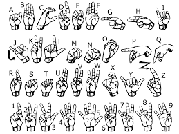

# American Sign Language Alphabet Detection using Webcam 

This project detects hand shapes to output the corresponding ALS alphabet
Webcam is used to cature the video and out detection results in realtime

Please refer: 
1)  https://www.youtube.com/watch?v=RuOMUK76-0Q&t=86s (SVM Implementation)
2)  https://github.com/mjk188/ASL-Translator (Repository for above Project)

## NEURAL NETWORK MODEL USED

MobileNet CNN architecture was used. The last 23 layers were retrained on the dataset to benefit from transfer learning

## DATASET USED

Data downloaded from https://www.kaggle.com/datamunge/sign-language-mnist. Data Augmentation techniques were used to further improve accuracy. 

## FILE DESCRIPTIONS

1. img_prep.py: Programme that does shape transformation and other related procedures  to                  input data for prediction through Neural Network during realtime                           application
2. mobiletrain.py: Notebook For training model
3. model.h5: trained MobileNet model
4. Masin_ASL_Prediction_App.ipynb: Main application programme. Run this programme to    
                                   launch application.

